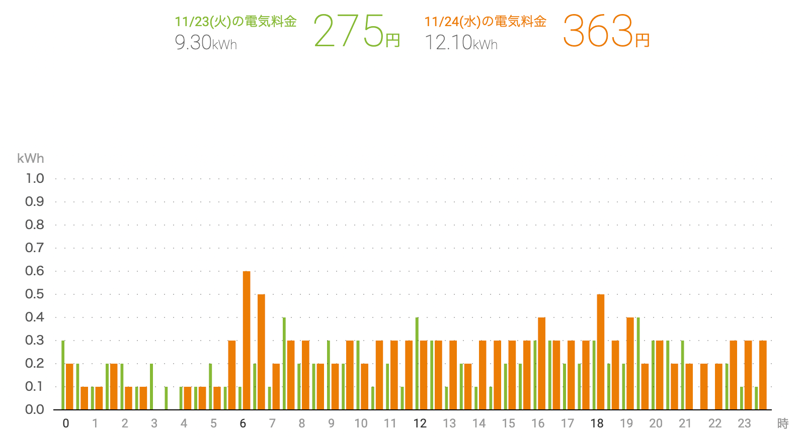
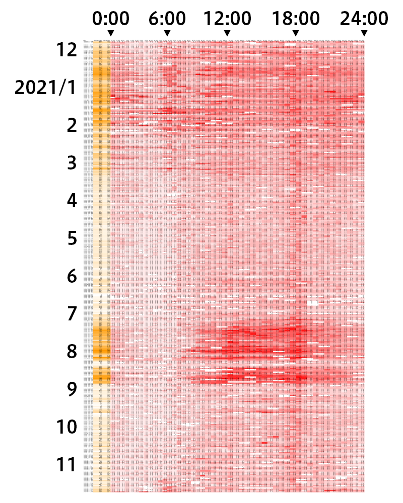

# auでんきの使用量をCSVにする

省エネ設備の導入検討にあたってまずは今の電気消費を把握しないと設備のグレードが決められないため、その調査をした記録です。

## auでんき

携帯電話とかauひかりで割引が効くのでauでんきを使っています。[管理画面]で電気の使用量などが確認できます。

[管理画面]: https://mieru.auone.jp/#/results/daily



グラフの元データである30分ごとの使用量の画面はあるのですが、CSV出力のようなものは提供されていないようです。

年間を通しての使用量の傾向が見たいので365日分のデータが必要ですが、画面クリック→コピーを365回やるのは辛いので↓の方法を考えました。

1. WebDriverの自動操作で取得
2. Web APIで取得

## WebDriverの自動操作で取得

やることは次の通りです。

1. [selenium-webdriver]で[管理画面]を開く
2. ログインする
3. 1日分ずつデータを表示して保存する

この実装が https://gitlab.com/gjbkz/au-denki にあります。

上記のコードを動かしているのがこれです。

```youtube
<iframe width="560" height="315" src="https://www.youtube.com/embed/WvFvqi_DCOM" title="YouTube video player" frameborder="0" allow="accelerometer; autoplay; clipboard-write; encrypted-media; gyroscope; picture-in-picture" allowfullscreen></iframe>
```

[selenium-webdriver]: https://www.npmjs.com/package/selenium-webdriver

## Web APIで取得

WebDriverを試した後に気が付いたのですが[管理画面]でDeveloper Toolsを見るとデータをJSONで受けているのがわかります。

```json Web APIのレスポンス
{
  "list": [
    {
      "contractId": "K000000000",
      "consignmentDate": "20210924",
      "dailyCost": 407,
      "dailyUsage": 13.9,
      "dataType": 0,
      "halfHourlyUsages": [
        {"usage": 0.3, "status": "0"},
        {"usage": 0.1, "status": "0"},
        {"usage": 0.2, "status": "0"},
        "以下略",
```

`K000000000`（マスク済み）はユーザーIDでしょう。エンドポイントは次のような形式でした。

```
https://mieru.auone.jp/app/api/v1/dailyPowerReports/K000000000
?startDate=20210924
&endDate=20211124
&withHalfHourlyUsages=1
```

確認できた特徴は次の通りです。

1. `startDate`と`endDate`は2ヶ月より幅があるとエラーになる
1. ヘッダーに`x-evass-api:1`が必要

したがってJavaScriptコンソールで↓を実行すると効率よくデータをGETできます。

```javascript 9月と10月のデータをGETするスクリプト
fetch(
  'https://mieru.auone.jp/app/api/v1/dailyPowerReports/K000000000?startDate=20210901&endDate=20211101&withHalfHourlyUsages=1',
  {headers: {'x-evass-api': '1'}},
)
```

WebDriverの方でデータは取得できていたのでここで手を動かすのはやめました。

## データの可視化

取得したデータをGoogleスプレッドシートに貼って条件付き書式のカラースケールで色をつけました。

1. 横軸が時刻、縦軸が日付です。
2. 赤色が濃いところが使用量が大きかった時間です。
3. 左端の黄色は一日分での比較です。



### 考察

1. 朝昼晩にピークがある。電子レンジ・トースター・ドライヤーとか？
2. 冬と夏の使用量が大きい。
3. 2021年8月15日前後は雨で気温が低く冷房を使わなかったことがわかる


[画像のソース（気象庁）](https://www.data.jma.go.jp/obd/stats/etrn/view/daily_s1.php?prec_no=44&block_no=47662&year=2021&month=08&day=&view=g_tem)
